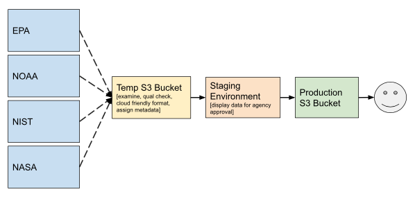

**1.1 Planning and Design**
-----------------------

<table>
<thead>
<tr class="header">
<th><strong>Requirement</strong></th>
<th><strong>Procedure</strong> [Role - Data Steward (DS) or Data Engineer (DE)]</th>
</tr>
</thead>
<tbody>
<tr class="odd">
<td>A1.1.1 Define a data flow diagram with the purpose of identifying data sources and touchpoints for the project and for communicating to data users how data was handled.</td>
<td>
B1.1.1 Data Flow Diagram from the 4 primary providers:

(Draft diagram - to be updated with greater detail)</td>
</tr>
<tr class="even">
<td>A1.1.2 Develop touchpoint agreements identified in the data flow diagram</td>
<td>B1.1.2 Agreements are handled at the HQ level.</td>
</tr>
<tr class="odd">
<td>A1.1.3 Adhere to community accepted standard machine readable data file formats</td>
<td>
B1.1.3 GHGC Use Case 1:

<ul>
<li><blockquote>

EPA Methane data delivered in NetCDF

</blockquote></li>

GHGC Use Case 2:

<li><blockquote>

Gridded CO2 data (format TBD)

</blockquote></li>

GHGC Use Case 3:

<li><blockquote>

Methane plume data from JPL delivered in COG

</blockquote></li>
</ul>

All data ingested into the GHGC system will be transformed into Cloud Optimized GeoTIFF (COG) format which is listed as an emerging standard.
</td>
</tr>
<tr class="even">
<td>A1.1.4 Identify and document all data product characteristics</td>
<td>B1.1.4 
The GHGC is collecting data product characteristic information in the following spreadsheet:<a href="https://docs.google.com/spreadsheets/d/199blJH2JBr5eyW-PaH6vCzsj1W8u5AigA4SpjSV04Rc/edit#gid=511491842"> GHG Center Dataset Information </a>

In addition, when working with a new data provider, we use the following form to collect dataset information from the provider: <a href="https://docs.google.com/document/d/1B892eXoiirZsw8rylgejNyw1Zh6Fhg1568EOMGUbWIA/edit"> GHGC Dataset Intake Form Template </a>
</td>
</tr>
<tr class="odd">
<td>A1.1.5 Adhere to community best practice(s) on data file naming conventions</td>
<td>B1.1.5 
<a href="https://docs.google.com/document/d/18GcGJeJBTzY6UH4F_F6s_c3cmvLuUs2TOwpiVaHwoEs/edit">GHG Center Naming Conventions</a>

We will work with file naming conventions in use unless the file convention used is confusing and poorly communicative. Only if needed, will we change file names of received data. For data we generate (such as transformations of provided data) we will use the following convention:

<ul>

<li><blockquote><mark>Dataset Shortname = (TBD)</mark></li>

<li><blockquote>Long Filename = GHGC_&ltagency&gt_&ltinstr&gt_&ltdate&gt_&ltoptional&gt_&ltversion&gt.ext where:</blockquote></li>

<ul><li><blockquote>&ltinstr&gt = instrument ID of  up to 10 letters; separated by a “_” from the next field o e.g., avaps, cpl, hamsr, hirad, s-his, hiwrap, … 
<blockquote></li></ul>

<ul><ul><li><blockquote>Navigation datasets should include the aircraft abbreviation in the instr field (e.g., er2, cit, …)<blockquote></li></ul></ul>

<ul><li><blockquote>&ltdate&gt = in yyyymmdd format; separated by a “_” from the next field.  Four digit years are required 
<blockquote></li></ul>

<ul><ul><li><blockquote>If both start and stop dates are required, then separate the two dates by an underscore.<blockquote></li></ul></ul>

</ul>
</td>
</tr>
<tr class="even">
<td>A1.1.6 Adhere to community standard variable names, types, and unit(s), keywords</td>
<td>
B1.1.6 We are working with what the agencies have provided. We need to understand and communicate the variables and units accurately. Any changes would need approval of the providing agency.
</td>
</tr>
<tr class="odd">
<td>A1.1.7 Adhere to community standards for coordinate systems</td>
<td>
B1.1.7 Utilize coordinate reference systems (CRS) from this list (<a href="https://epsg.io/">https://epsg.io/</a>) [DE]

<ul>
<li><blockquote>

Recommended global CRS:

</blockquote>
<ul>
<li><blockquote>

2-dimensional World Geodetic System 1984 (WGS 84) (Lat/Long): <a href="https://epsg.io/4326">EPSG:4326</a>

</blockquote>
<ul>
<li><blockquote>

WGS 84 World Mercator: <a href="https://epsg.io/3395">EPSG:3395</a>

</blockquote></li>
<li><blockquote>

WGS 84 Pseudo-Mercator: <a href="https://epsg.io/3857">EPSG:3857</a>

</blockquote></li>
</ul></li>
<li><blockquote>

3-dimensional WGS 84 (Lat/Long/Elevation): <a href="https://epsg.io/4979">EPSG:4979</a>

</blockquote></li>
</ul></li>
<li><blockquote>

Recommended CRS for data over polar regions:

</blockquote>
<ul>
<li><blockquote>

WGS 84 Arctic Polar Stereographic: <a href="https://epsg.io/3995">EPSG:3995</a>

</blockquote>
<ul>
<li><blockquote>

NSIDC Sea Ice Polar Stereographic North: <a href="https://epsg.io/3413">EPSG:3413</a>

</blockquote></li>
<li><blockquote>

NSIDC Sea Ice Polar Stereographic South: <a href="https://epsg.io/3976">EPSG:3976</a>

</blockquote></li>
</ul></li>
</ul></li>
</ul></td>
</tr>
<tr class="even">
<td>A1.1.8 Adhere to community standards for map projections</td>
<td>B1.1.8 Utilize map projections from this list (<a href="https://epsg.io/">https://epsg.io/</a>)<ul><li><blockquote>In most cases, we will keep data as sent to us provided the projection is a standard projection. If we need to transform to another projection, we will use WGS84</blockquote></li></ul></td>
</tr>
<tr class="odd">
<td>A1.1.9 Adhere to community standards for date and time formats</td>
<td>B1.1.9 To maximize interoperability of the data received from the various agencies all received data will be converted to a single date/time standard format. The format used will be<a href="https://www.w3.org/TR/NOTE-datetime"> ISO 8601</a> [DE]</td>
</tr>
<tr class="even">
<td>A1.1.10 Define a data product versioning scheme</td>
<td>B1.1.10 
The data version in use by the providing agency will be used by GHGC when presenting the data.

However, there may be cases where no version numbering has been used. In that case we will add V1.0 to the product so that if the data is replaced in the future we have a means to indicate the new version. In our system, decimal numbers indicate minor changes to the product and whole numbers indicate significant product overhaul including algorithm improvements or new data inputs in production.
</td>
</tr>
<tr class="odd">
<td>A1.1.11 Define a science quality evaluation plan for data products</td>
<td>
B1.1.11 The GHGC does the following checks to ensure the integrity of the data brought into the system: 

<blockquote><strong>Data Transfer Confirmation:</strong></blockquote>
<ul>

<li><blockquote>Overall checksum report (if used in data transfer
</blockquote></li>

<li><blockquote>Results from individual checksum file comparisons of pre-transfer and post-transfer</blockquote></li>

<li><blockquote>Report any individual file issues</blockquote></li>
</ul>

<blockquote><strong>Overall Dataset Statistics:</strong></blockquote>

<ul>

<li><blockquote>Data file reads confirmed</blockquote></li>

<li><blockquote>Mean, min, max across all files</blockquote></li>

<li><blockquote>Distribution of values across all data (by variable)</blockquote></li>

<li><blockquote>What file range (most cases will be all files)</blockquote></li>

<li><blockquote>Bounding box of all data</blockquote></li>

<li><blockquote>Link to transformation record in Jupyter Notebook</blockquote></li>

<li><blockquote>All values are in expected range (catches out of range values)</blockquote></li>
</ul>

<blockquote><strong>Visual Confirmation and Random Sample Checking:</strong></blockquote>
<ul>

<li><blockquote>Visual example and side by side comparison</blockquote></li>

<li><blockquote>More detailed statistics for specific files (randomly chose)</li></blockquote>

<li><blockquote>Data Comparison at a few specific locations</li></blockquote>

</blockquote></li>

The results of these checks are documented in a Dataset Intake Processing and Verification Report that is shared with the data provider using the following template: <a href="https://docs.google.com/document/d/1Ni-aRIkNwTPTZYZDnZ3Ckg2Ew-nZLCUUN5OepDypc1c/edit">GHGC Dataset Intake Report Template</a>
Intake reports are also made publicly accessible in the GHGC_docs GitHub repository: <a href="https://github.com/US-GHG-Center/ghgc-docs/tree/main/processing_and_verification_reports">https://github.com/US-GHG-Center/ghgc-docs/tree/main/processing_and_verification_reports</a>

</ul>
</td>
</tr>
<tr class="even">
<td>A1.1.12 Develop a data retention plan including a process for when and how data will be sunset</td>
<td>
B1.1.12

<mark>Action: check with Manil</mark>

Maintain for the lifespan of the GHGC or unless the agency requests that the data be retired.
</td>
</tr>
<tr class="odd">
<td>
A.1.1.13 Define metrics to be collected along the following dimensions:

<ul>
<li><blockquote>

Data use (search and access)

</blockquote></li>
<li><blockquote>

Data quality

</blockquote></li>
<li><blockquote>

Data/information (quality) profile

</blockquote></li>
<li><blockquote>

Data Processing

</blockquote></li>
<li><blockquote>

Ingest

</blockquote></li>
<li><blockquote>

Data Access APIs/Services

</blockquote></li>
</ul></td>
<td>
B1.1.13 <mark>Action: Check with Abdelhak on feasibility of these metrics for GHGC. What other metrics do we need? Note: implementing Google Analytics to track website usage metrics. Lets capture what metrics are captured with Google Analytics in a separate doc and link here. Action: document baseline metrics for R1 Document ideal metrics for full release.</mark>

Recommended minimum metrics:

<blockquote>

<strong>Data Use Metrics</strong>

</blockquote>
<ul>
<li><blockquote>

Data Product Search frequency

</blockquote></li>
<li><blockquote>

S3 Bucket Access frequency

</blockquote></li>
<li><blockquote>

Data download counts

</blockquote></li>
</ul>
<blockquote>

<strong>Information/Data Profile</strong>:

</blockquote>
<ul>
<li><blockquote>

Metadata completeness

</blockquote></li>
</ul>
<blockquote>

<strong>Data Processing</strong>

</blockquote>
<ul>
<li><blockquote>

Processing time

</blockquote></li>
<li><blockquote>

Processing throughput

</blockquote></li>
<li><blockquote>

Error rate

</blockquote></li>
<li><blockquote>

Resource utilization

</blockquote></li>
</ul>
<blockquote>

<strong>Ingest</strong>:

</blockquote>
<ul>
<li><blockquote>

Ingest rate

</blockquote></li>
<li><blockquote>

Ingest completeness / volume

</blockquote></li>
<li><blockquote>

Ingest error rate

</blockquote></li>
</ul>
<blockquote>

<strong>Data Access APIs/Services</strong>:

</blockquote>
<ul>
<li><blockquote>

Service availability

</blockquote></li>
<li><blockquote>

Service usage

</blockquote></li>
<li><blockquote>

Service response time

</blockquote></li>
<li><blockquote>

Service error rate

</blockquote></li>
</ul></td>
</tr>
<tr class="even">
<td>A1.1.14 Identify the most appropriate data license for the data product</td>
<td>B1.1.14 If there are no other restrictions, SMD scientific data should be released with a Creative Commons Zero license. [DS]</td>
</tr>
<tr class="odd">
<td>A1.1.15 Determine content and format for the dataset landing page</td>
<td>
B1.1.15 Design dataset landing page format and content. Recommend using the <a href="https://docs.google.com/document/d/1qEoqYMh6K0QjY4HFqJ55yinwn4u0s22j88IAED583_U/edit?usp=sharing">IMPACT data product landing page design</a>. [DS]

Note that dataset landing pages can be automatically generated using UMM metadata (published to CMR) and STAC metadata (using STAC Browser). All information needed in the dataset landing page should be included in the metadata.
</td>
</tr>
<tr class="even">
<td>A1.1.16 Determine whether API-based data access is needed &amp; if so, identify an API standard</td>
<td>
B1.1.16a API-based data access will be provided for the GHGC via the STAC API.

B1.1.16b The STAC API is fully aligned with <a href="http://docs.opengeospatial.org/is/17-069r3/17-069r3.html">OGC API-Features</a> Version 1.0, and STAC is working to stay aligned as additional OGC API components mature.
</td>
</tr>
</tbody>
</table>
